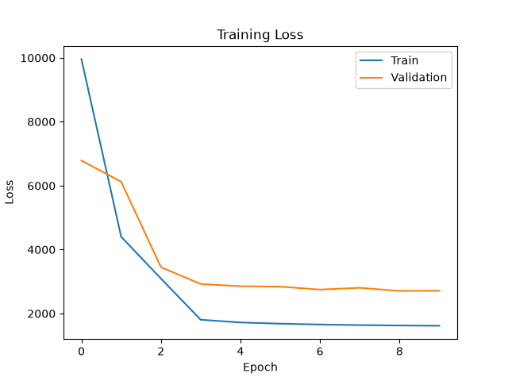
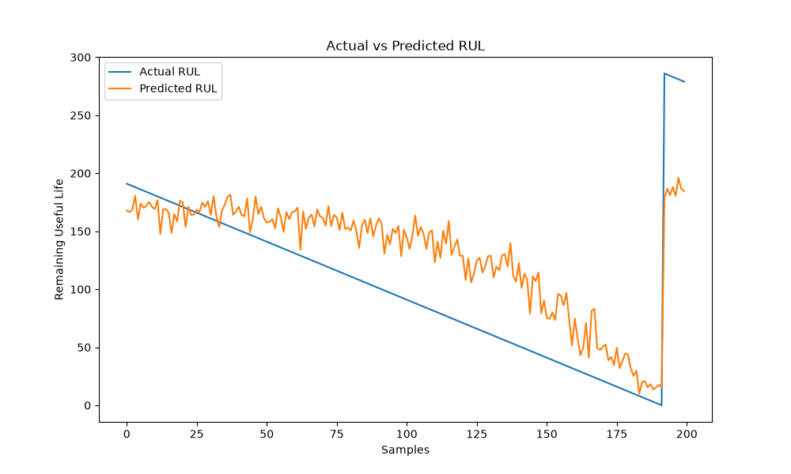

# AI-Based Aircraft Engine Health Monitoring System

## Overview

This project develops an AI-powered Aircraft Engine Health Monitoring System using Long Short-Term Memory (LSTM) deep learning models to predict the Remaining Useful Life (RUL) of aircraft engines. By analyzing engine sensor data from the NASA C-MAPSS dataset, the system supports predictive maintenance and helps reduce unexpected engine failures.

---

## Features

* Aircraft Engine Health Monitoring
* Remaining Useful Life (RUL) Prediction
* Predictive Maintenance Support
* Sensor Data Analysis
* LSTM-Based Deep Learning Model
* Model Evaluation and Visualization

---

## Technologies Used

* Python
* TensorFlow
* Keras
* Pandas
* NumPy
* Matplotlib
* Scikit-learn

---

## Dataset

**NASA C-MAPSS Turbofan Engine Degradation Simulation Dataset**

The dataset contains multivariate sensor readings collected from aircraft engines operating under different conditions and degradation patterns.

**Note:** Due to GitHub storage limitations, the dataset files are not included in this repository. Users can download the NASA C-MAPSS dataset separately and place the files inside a local `data/` directory.

---

## Project Workflow

1. Data Collection
2. Data Preprocessing
3. Feature Engineering
4. Sensor Data Normalization
5. LSTM Model Development
6. Model Training
7. Remaining Useful Life Prediction
8. Model Evaluation
9. Performance Visualization

---

## Model Architecture

The project uses a Long Short-Term Memory (LSTM) neural network to capture temporal patterns from aircraft engine sensor data.

Architecture:

* LSTM Layer (64 Units)
* Dense Layer (32 Units)
* Output Layer (RUL Prediction)

Loss Function:

* Mean Squared Error (MSE)

Optimizer:

* Adam

---

## Results

### Training Loss Curve



The loss curve demonstrates the learning behavior of the LSTM model during training and validation phases.

### Actual vs Predicted RUL



The graph compares actual Remaining Useful Life values with model predictions generated by the trained LSTM network.

### Model Performance

| Metric          | Value   |
| --------------- | ------- |
| Training Loss   | 1617.67 |
| Validation Loss | 2712.76 |
| Training MAE    | 29.42   |
| Validation MAE  | 38.00   |

---

## Generated Artifacts

* Trained Model (`engine_model.h5`)
* Training Loss Graph (`loss_curve.png`)
* Actual vs Predicted RUL Graph (`actual_vs_predicted.png`)
* Model Evaluation Results

---

## Applications

* Aircraft Predictive Maintenance
* Engine Health Monitoring
* Failure Prediction
* Maintenance Planning
* Reliability Engineering
* Aerospace Analytics

---

## Project Structure

```text
Aircraft-Engine-Health-Monitoring/
│
├── src/
│   ├── data_preprocessing.py
│   ├── model.py
│   ├── train.py
│   ├── predict.py
│   └── evaluate.py
│
├── results/
│   ├── loss_curve.png
│   ├── actual_vs_predicted.png
│   ├── engine_model.h5
│   └── results.md
│
├── data/
│
├── notebooks/
│
├── README.md
├── requirements.txt
└── .gitignore
```

---

## Installation

```bash
pip install -r requirements.txt
```

---

## Run Training

```bash
cd src
py -3.11 train.py
```

---

## Run Evaluation

```bash
cd src
py -3.11 evaluate.py
```

---

## Future Enhancements

* Hyperparameter Optimization
* Real-Time Aircraft Monitoring Dashboard
* Deployment using Streamlit
* Advanced Feature Engineering
* Multi-Dataset Training (FD001–FD004)

---

## Author

**Panjala Shambhavi**

B.Tech Artificial Intelligence & Machine Learning (AIML)
